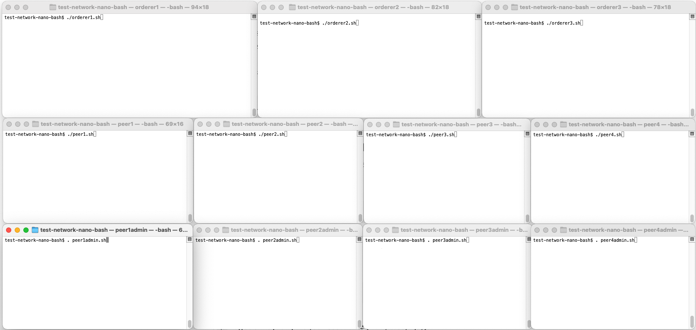

# Test network - Nano bash

Rede de teste Nano bash fornece um conjunto de scripts bash mínimos para executar uma rede Fabric em sua máquina local.
A rede é funcionalmente equivalente à Test Network baseada em docker, portanto, você pode executar todos os tutoriais e amostras que visam a Test Network com alterações mínimas.
Os binários de lançamento do Fabric são utilizados em vez de usar contêineres docker para evitar todas as camadas desnecessárias. E você pode escolher entre executar o chaincode e o construtor do chaincode em um contêiner docker nos bastidores ou executar o chaincode como um serviço sem nenhum contêiner.
Usar os binários do Fabric também simplifica para os desenvolvedores do Fabric modificar iterativamente e rapidamente o código do Fabric e testar uma rede Fabric como um usuário.

Como o nome `nano` indica, os scripts fornecem a menor configuração mínima possível para uma rede Fabric, ao mesmo tempo em que oferecem uma rede habilitada para TLS de vários nós:
- Conjunto mínimo de dependências
- Requisitos mínimos na versão Fabric (qualquer v2.x orderer e peer nodes devem funcionar)
- Conjunto mínimo de substituições de variáveis ​​de ambiente das configurações padrão orderer.yaml e peer core.yaml do orderer
- Script mínimo com conjunto mínimo de comandos de referência para colocar uma rede Fabric em funcionamento
- Configuração mínima de canal para uma organização orderer (3 nós ordering) e duas organizações peer (com dois peers cada)
- Política mínima de endosso para permitir que uma única organização aprove e confirme um chaincode (ao contrário da Test Network, que exige que ambas as organizações endossem)

# Pré-requisitos

- Siga a documentação do Fabric para os [Pré-requisitos](https://hyperledger-fabric.readthedocs.io/en/latest/prereqs.html)
- Siga a documentação do Fabric para [baixar os exemplos e binários do Fabric](https://hyperledger-fabric.readthedocs.io/en/latest/install.html). Você pode pular os downloads de imagem do docker usando `./install-fabric.sh binary samples`

## Para executar o chaincode como um serviço
Você precisa configurar o peer para usar o construtor externo `ccaas` baixado com os binários acima.
O caminho especificado no arquivo de configuração padrão é válido apenas dentro do contêiner do peer que você não usará.
Edite o arquivo `fabric-samples/config/core.yaml` e modifique o campo `externalBuilders` para apontar para o caminho correto.
A configuração deve ser parecida com a seguinte:

```yaml
externalBuilders:
- name: ccaas_builder
path: /Users/nanofab/fabric-samples/builders/ccaas
propagateEnvironment:
- CHAINCODE_AS_A_SERVICE_BUILDER_CONFIG
```

Se você tiver [yq](https://mikefarah.gitbook.io/yq/) instalado, execute o seguinte comando no diretório `fabric-samples` para atualizar a configuração:

```shell
yq -i 'del(.chaincode.externalBuilders) | .chaincode.externalBuilders[0].name = "ccaas_builder" | .chaincode.externalBuilders[0].path = env(PWD) + "/builders/ccaas" | .chaincode.externalBuilders[0].propagateEnvironment[0] = "CHAINCODE_AS_A_SERVICE_BUILDER_CONFIG"' config/core.yaml
```

# Instruções para iniciar a rede

## Executando cada componente separadamente

Abra janelas de terminal para 3 nós de ordenação, 4 nós de peer e 4 administradores de peer, conforme visto na configuração de terminal a seguir. Os dois primeiros peers e administradores de peer pertencem à Org1, os dois últimos peer e administradores de peer pertencem à Org2.
Observe que você pode começar com dois nós de ordenação e um único nó de peer da Org1 e um único terminal de administração de peer da Org1 se quiser manter as coisas ainda mais minimalistas (dois nós de ordenação são necessários para atingir o consenso (2 de 3), enquanto um único peer da Org1 pode ser utilizado, pois a política de endosso é definida como qualquer organização única).


As instruções a seguir farão com que você execute scripts bash simples que definem substituições de variáveis ​​de ambiente para um componente e, em seguida, executam o componente.
Os scripts contêm apenas comandos simples de linha única para que sejam fáceis de ler e entender.
Se você tiver problemas para executar scripts bash em seu ambiente, você pode facilmente copiar e colar os comandos individuais dos arquivos de script em vez de executar os arquivos de script.

- cd para o diretório `test-network-nano-bash` em cada janela do terminal
- No primeiro terminal do ordenador, execute `./generate_artifacts.sh` para gerar material criptográfico (chama cryptogen) e bloco de gênese de canal de sistema e aplicativo e transações de configuração (chama configtxgen). Os artefatos serão criados nos diretórios `crypto-config` e `channel-artifacts`.
- Nos três terminais do ordenador, execute `./orderer1.sh`, `./orderer2.sh`, `./orderer3.sh` respectivamente
- Nos quatro terminais do peer, execute `./peer1.sh`, `./peer2.sh`, `./peer3.sh`, `./peer4.sh` respectivamente
- Observe que cada ordenador e peer grava seus dados (incluindo seus livros-razão) em seu próprio subdiretório sob o diretório `data`
- Nos quatro terminais do administrador do peer, execute `source peer1admin.sh && ./create_channel.sh`, `source peer2admin.sh && ./join_channel.sh`, `source peer3admin.sh && ./join_channel.sh`, `source peer4admin.sh && ./join_channel.sh` respectivamente

Observe a sintaxe de execução dos scripts. Os scripts de administração de pares definem as variáveis ​​de ambiente de administração e devem ser executados com o comando `source` para que as variáveis ​​de ambiente exportadas possam ser utilizadas por quaisquer comandos de usuário subsequentes.

O script `create_channel.sh` cria o canal de aplicativo `mychannel`, atualiza a configuração do canal para o par de âncora de fofoca e une o par a `mychannel`.
O script `join_channel.sh` une um par a `mychannel`.

## Iniciando a rede com um comando

Usar os scripts individuais acima dá a você mais controle do processo de iniciar uma rede Fabric e demonstra como todos os componentes necessários se encaixam, no entanto, a mesma rede também pode ser iniciada usando um único script para conveniência.

```shell
./network.sh start
```

Após a rede ter iniciado, use terminais separados para executar comandos de pares.
Você precisará configurar o ambiente de pares para cada novo terminal.
Por exemplo, para executar contra peer1, use:

```shell
source peer1admin.sh
```

# Instruções para implantar e executar o chaincode de amostra de transferência básica de ativos

Para implantar e invocar o chaincode, utilize o terminal de administração peer1 que você criou nas etapas anteriores. Você tem duas possibilidades:

1. Usar um contêiner chaincode
2. Executar o chaincode como um serviço

## 1. Usar um contêiner chaincode

Empacote e instale o chaincode no peer1:

```shell
peer lifecycle chaincode package basic.tar.gz --path ../asset-transfer-basic/chaincode-go --lang golang --label basic_1

peer lifecycle chaincode install basic.tar.gz
```

A instalação do chaincode pode levar um minuto, pois a imagem docker do construtor chaincode `fabric-ccenv` será baixada se ainda não estiver disponível em sua máquina. Copie o ID do pacote chaincode retornado em uma variável de ambiente para uso em comandos subsequentes (seu ID pode ser diferente):

```shell
export CHAINCODE_ID=basic_1:faaa38f2fc913c8344986a7d1617d21f6c97bc8d85ee0a489c90020cd57af4a5
```

## 2. Executando o chaincode como um serviço

Empacote e instale o chaincode externo no peer1 com os seguintes comandos simples:

```shell
cd chaincode-external

tar cfz code.tar.gz connection.json
tar cfz external-chaincode.tgz metadata.json code.tar.gz

cd ..

peer lifecycle chaincode install chaincode-external/external-chaincode.tgz
```

Copie o ID do pacote chaincode retornado em um ambiente variável para uso em comandos subsequentes (seu ID pode ser diferente):

```shell
export CHAINCODE_ID=$(peer lifecycle chaincode calculatepackageid chaincode-external/external-chaincode.tgz) && echo $CHAINCODE_ID
```

Em outro terminal, navegue até `fabric-samples/asset-transfer-basic/chaincode-typescript` e crie o chaincode:

```shell
npm install
npm run build
```

Defina o ID do pacote chaincode novamente (este é um terminal diferente):

```shell
export CHAINCODE_ID=$(peer lifecycle chaincode calculatepackageid ../../test-network-nano-bash/chaincode-external/external-chaincode.tgz) && echo $CHAINCODE_ID
```

Defina o endereço do servidor chaincode:

```shell
export CHAINCODE_SERVER_ADDRESS=127.0.0.1:9999
```

E inicie o serviço chaincode:

```shell
npm run start:server-nontls
```

## Ative o chaincode

Usando o administrador peer1, aprove e confirme o chaincode (apenas um único aprovador é necessário com base na política de endosso do ciclo de vida de qualquer organização):

```shell
peer lifecycle chaincode approveformyorg -o 127.0.0.1:6050 --channelID mychannel --name basic --version 1 --package-id $CHAINCODE_ID --sequence 1 --tls --cafile ${PWD}/crypto-config/ordererOrganizations/example.com/orderers/orderer.example.com/tls/ca.crt

peer lifecycle chaincode commit -o 127.0.0.1:6050 --channelID mychannel --name basic --version 1 --sequence 1 --tls --cafile "${PWD}"/crypto-config/ordererOrganizations/example.com/orderers/orderer.example.com/tls/ca.crt
```

**Observação:** após seguir as instruções acima, o chaincode será instalado somente no peer1 e estará disponível somente no shell peer1admin.
Reexecute o comando `peer lifecycle chaincode install` em outros shells de administração de peer para instalá-lo no peer correspondente.
Você também precisará executar novamente o comando `peer lifecycle chaincode approveformyorg` para usar o chaincode em peers em outra organização, por exemplo, usando o shell peer3admin.

## Interaja com o chaincode

Invoque o chaincode para criar um ativo (apenas um único endossante é necessário com base na política de endosso padrão de qualquer organização).
Em seguida, consulte o ativo, atualize-o e consulte novamente para ver as alterações de ativos resultantes no livro-razão. Observe que você precisa esperar um pouco para que as transações de invocação sejam concluídas.

```shell
invocação de código de cadeia de pares -o 127.0.0.1:6050 -C meucanal -n básico -c '{"Args":["CriarAtivo","1","azul","35","tom","1000"]}' --tls --cafile "${PWD}"/crypto-config/ordererOrganizations/example.com/orderers/orderer.example.com/tls/ca.crt

consulta de código de cadeia de pares -C meucanal -n básico -c '{"Args":["LerAtivo","1"]}'

invocação de código de cadeia de pares -o 127.0.0.1:6050 -C meucanal -n básico -c '{"Args":["AtualizarAtivo","1","azul","35","jerry","1000"]}' --tls --cafile "${PWD}"/crypto-config/ordererOrganizations/example.com/orderers/orderer.example.com/tls/ca.crt

peer chaincode query -C mychannel -n basic -c '{"Args":["ReadAsset","1"]}'
```

Parabéns, você implantou uma rede Fabric mínima! Inspecione os scripts se quiser ver o conjunto mínimo de comandos necessários para implantar a rede.

# Parando a rede

Se você iniciou os componentes Fabric individualmente, utilize `Ctrl-C` nas janelas do terminal do orderer e do peer para encerrar os processos do orderer e do peer. Você pode executar os scripts novamente para reiniciar os componentes com seus dados existentes ou executar `./generate_artifacts` novamente para limpar os artefatos e dados existentes se quiser reiniciar com um ambiente limpo.
If you used the `network.sh` script, utilize `Ctrl-C` to kill the orderer and peer processes. You can restart the network with the existing data, or run `./network.sh clean` to remove old data before restarting.
